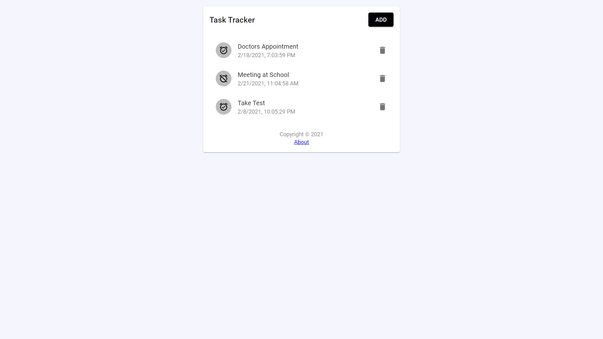

# React Task Tracker

> Task tracker app built with React and Material-UI. Used JSON Placeholder as a fake API for testing and prototyping.

[http://abshekh.github.io/React-Task-Tracker/](http://abshekh.github.io/React-Task-Tracker/)



## Quick Start

### Install Dependencies (frontend)

```bash
# Install dependencies
npm install
```

### Run

```bash
# Run the client
npm start

# Client runs on http://localhost:3000
```
